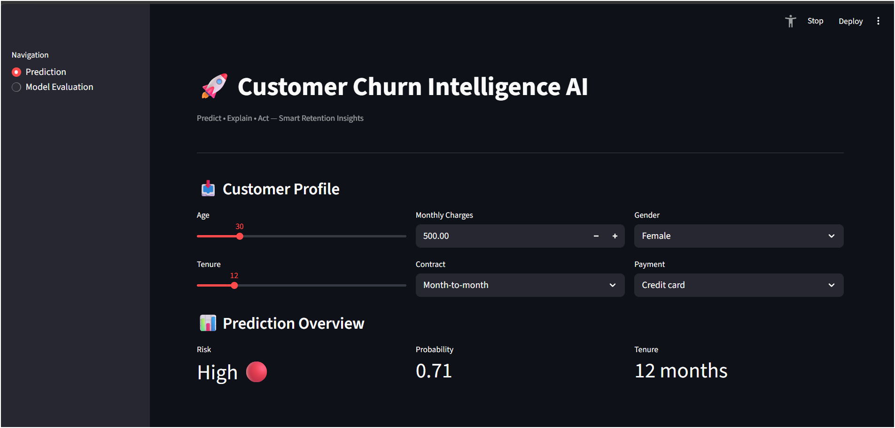
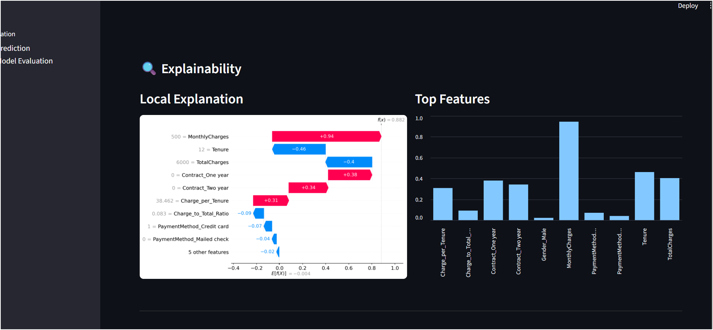
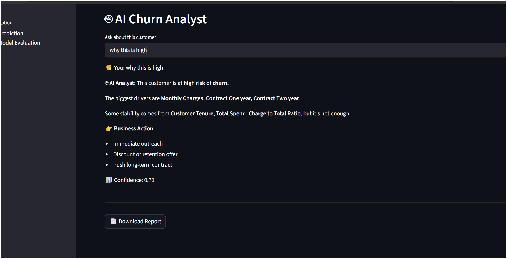

# 🚀 Customer Churn Intelligence AI

Predict • Explain • Act — Smart Retention Insights

---

## 📌 Overview

This is an **AI-powered Customer Churn Prediction System** built using Machine Learning and Streamlit.

It helps businesses:
- Identify customers likely to churn
- Understand key reasons behind churn
- Take actionable business decisions

---

## 🖼️ Dashboard Preview

### 📊 Main Dashboard


### 🔍 SHAP Explainability


### 🤖 AI Chatbot


---

## 🔥 Features

### 📊 Churn Prediction
- Predict churn probability
- Risk classification:
  - 🟢 Low
  - 🟠 Medium
  - 🔴 High

---

### 🎯 Interactive Dashboard
- KPI Metrics (Risk, Probability, Tenure)
- Gauge Chart Visualization
- Clean SaaS UI

---

### 🔍 Explainable AI (SHAP)
- Waterfall chart (local explanation)
- Feature importance graph
- Global summary insights

---

### 🤖 AI Churn Analyst
- Human-like chatbot
- Explains churn reasoning
- Gives business recommendations
- Domain-specific responses only

---

### 📊 Model Evaluation
- ROC Curve (AUC Score)
- Confusion Matrix
- Performance validation

---

### 📄 PDF Report
- Download customer insights
- Business-friendly summary

---

## 🧠 Tech Stack

- Python
- Streamlit
- Scikit-learn
- Pandas / NumPy
- Plotly
- Matplotlib
- SHAP
- ReportLab

---

## 📁 Project Structure
customer_churn/
│
├── assets/
│ ├── Dashboard.png
│ ├── SHAP Graph.png
│ └── Chatbot (2).png
│
├── app.py
├── model.pkl
├── columns.pkl
├── requirements.txt
└── README.md

---

## ⚙️ Run Locally

```bash
git clone https://github.com/sumit312-cpu/customer_churn.git
cd customer_churn

pip install -r requirements.txt
streamlit run app.py

🌐 Live Demo

👉 (Add after deployment)

https://your-app-name.streamlit.app

🎯 Use Cases
Telecom companies
SaaS platforms
Subscription businesses
Banking & Finance
🚀 Future Improvements
🔐 Login System
🗄 Database Integration
☁️ Cloud Deployment
📊 Real-time data pipeline
👨‍💻 Author

Sumit Tiwari
Aspiring Data Scientist | AI/ML Engineer

⭐ Support

If you like this project, give it a ⭐ on GitHub!